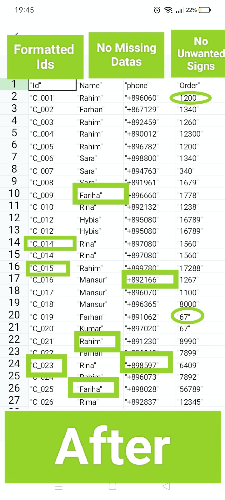

# pandas-data-cleaning-portfolio
This is my portfolio of Data cleaning and formatting. I have cleaned the messy Dataset to fit the consistent Patterns and made it capable for further data analysis. In this Portfolio:

1)Standardized String Values
2)All Values are consistent and capitalized
3)Removed Unwanted Signs and symbols
4)Filled Missing Values,Errors and Irrelavent Datas
5)Converted Values into suitable Data type for further Data Analysis
