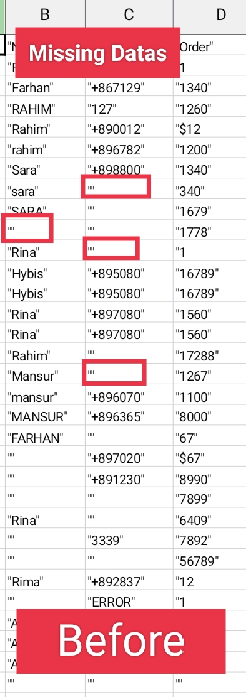
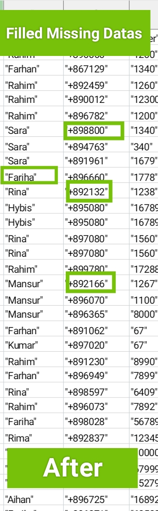
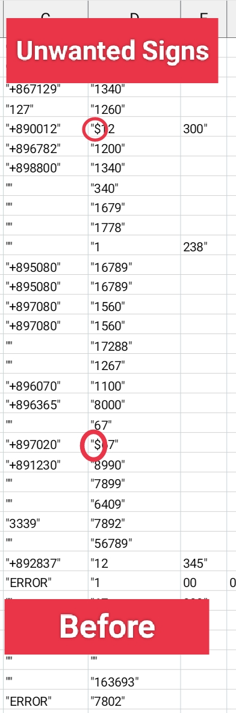

### 🧹 Data Cleaning Portfolio

### Filled Missing Values with Randomly Generated Values

Before::

Source Code ::

numbers = random.choices(string.digits,k=4)
phoneNum = "+89" + "".join(numbers)
objDf["phone"].loc[objDf["phone"].isna()] = phoneNum

After/Output ::

### Removed Unwanted signs (like @,£,&,$) from the data to convert into integar and for further data analysis

Before ::

Source Code ::

