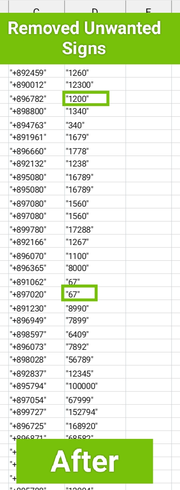
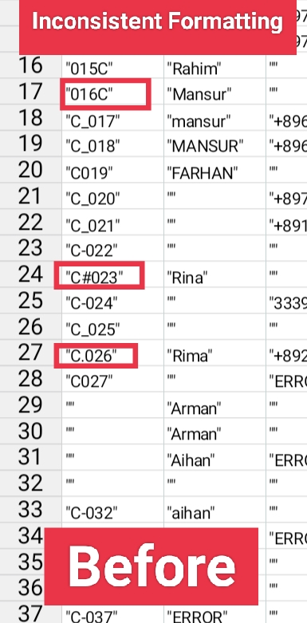
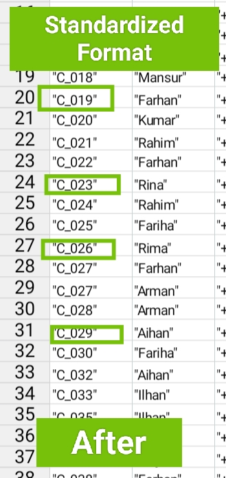

### 🧹 Data Cleaning Portfolio

### Filled Missing Values with Randomly Generated Values

Before::

Source Code ::

numbers = random.choices(string.digits,k=4)
phoneNum = "+89" + "".join(numbers)
objDf["phone"].loc[objDf["phone"].isna()] = phoneNum

After/Output ::

### Removed Unwanted signs (like @,£,&,$) from the data to convert into integar and for further data analysis

Before ::

Source Code ::

objDf["Order"] = objDf["Order"].str.replace(r'\$','',regex = True)

objDf["Order"] = pd.to_numeric(objDf["Order"], errors='coerce')

After/Result ::

### Fixed Inconsistent Formatting by creating standardized Data Format

Before ::

Source Code ::
numbers = objDf["Id"].str.extract(r'(\d+)')
objDf["Id"] = "C_" + numbers[0].str.zfill(3)

After/Result ::

